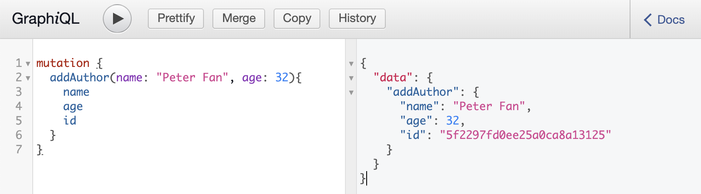
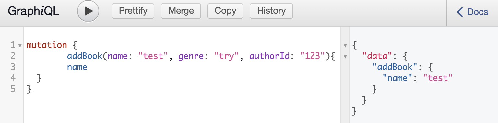
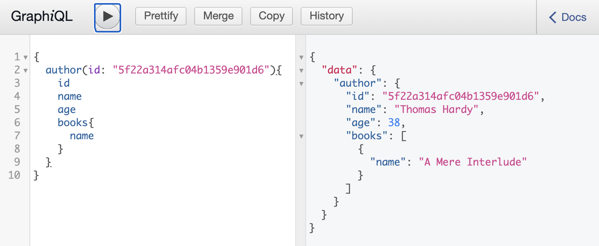
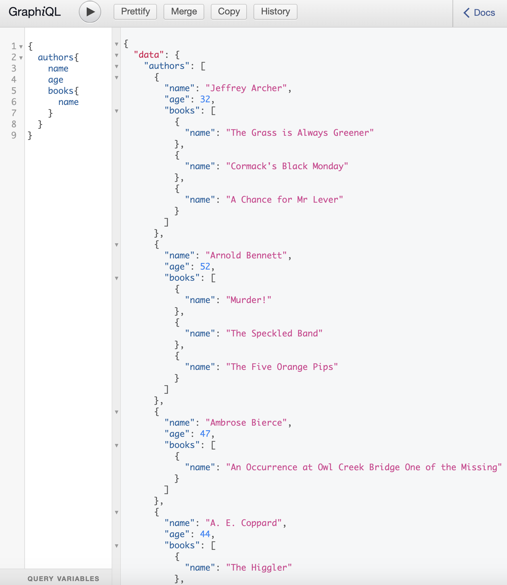
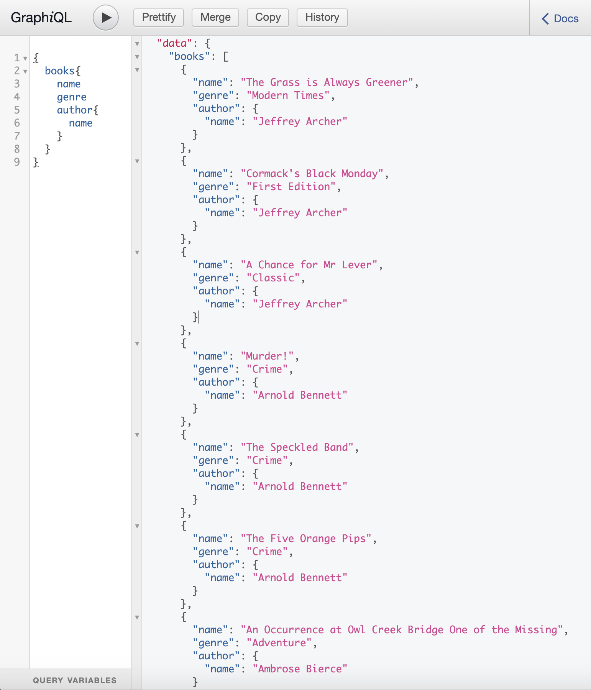
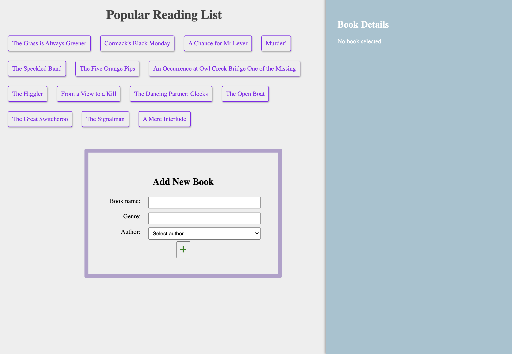
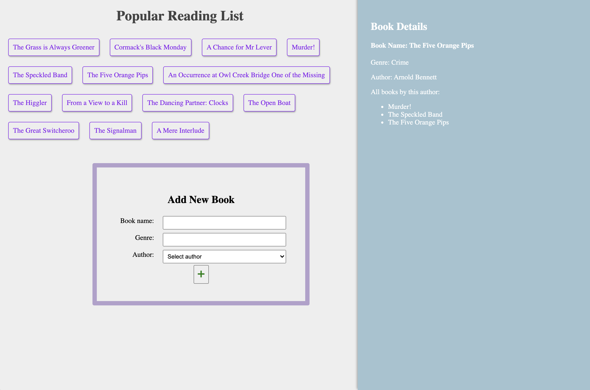
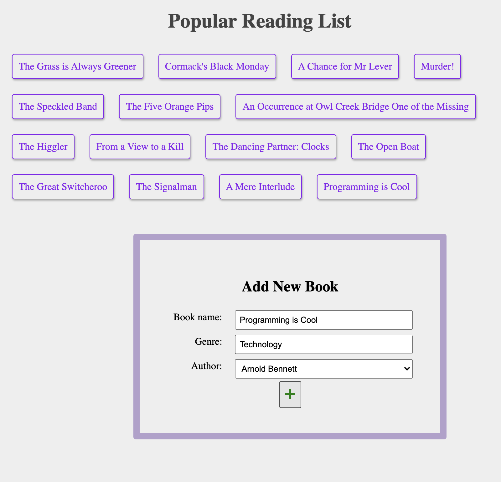

# Popular Book List  

## Project Structure  

This project includes 2 parts:  
1. Server Side  
- using mlab database  
  - hidden `<password>` and `<dbname>`, to replace the url in `server/app.js:15`  
- using graphql for server to get the data   

2. Client Side
- using react to create web interface  
- using apollo graphql for client to get the data  

## Start the project

1. Start Server side under popular-book-list directory  
`cd server`  
`npm install`  
`node app`  
http://localhost:5000/graphql  

#### Screen Shot
  
  
  
  
  

2. Start Client side under popular-book-list directory  
`cd client`  
`npm install`  
`npm start`  
http://localhost:3000  

#### Screen Shot
  
  
  
